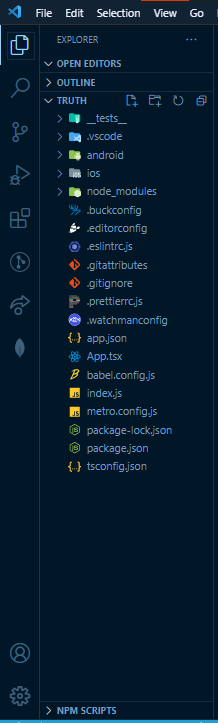
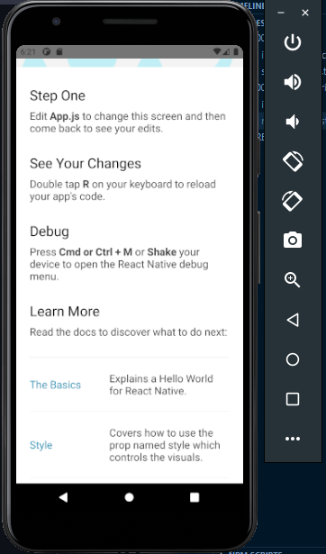

**Cover Image Credits**: Photo by *[Muhammad Rosyid Izzulkhaq](https://unsplash.com/@rsdiz)*

For Javascript developers out there, I'm certain we've all heard about the popular kids on the block. I'm talking about React Native (A Cross-platform mobile app development library) and Typescript (A Javascript superset with static typing).

If you haven't heard about Typescript, here's a blog post that serves as an [Introduction to Typescript and its Basic Types](https://blog.evansibok.com/introduction-to-typescript-and-its-basic-types).

### Prerequisite
1. A basic understanding of Javascript and React
2. Has already setup development environment for React Native, otherwise, refer to the [React Native Environment Setup Guide](https://reactnative.dev/docs/environment-setup)

## Introduction
In this post, we will begin our [building-in-public](https://blog.evansibok.com/series/truth) series, where we will learn how to initialize a new React Native project with Typescript support.

We will focus on initializing a sample application with all its project files.

Without further ado, let's get started!

## Initialize a new React Native App

- **Cd into a folder where you want to create your application.**

For me, that folder is `projects`.

When you're inside the folder, run the command below to create a new react native application with typescript support:
```
react-native init truth --template react-native-template-typescript
```

The command above uses the official `react-native-cli` to create a new application called `truth` and installs a template with typescript support. You must have the `react-native-cli` package installed globally on your machine for the code above to work.

If you don't want to install the `react-native-cli` global package you can run the code below to get the same results. Like this:
```
npx react-native init truth --template react-native-template-typescript
```


- **Cd into the app project directory.**

```
cd truth
```
The code above enables us to navigate into the newly created app folder.

- **Open the application in your code editor of choice.**

The application folder structure should look like this:



## Finalize configuration
If you look at the project structure image above, you will see that we have a `tsconfig.json` file. This is the file where our typescript configurations live in.

Before we proceed to run our app, we will have to add custom path mappings for our project to make it easier for folder access and navigation.

To do this:

- **Open the `tsconfig.json` file, find the lines of code that look like these that have been commented out**:
```
"baseUrl": './',
"paths": {},
```
- **Uncomment the `baseUrl` line, and replace the `paths` line with the following code**:
```
"paths": {
  "*": ["src/*"],
  "tests": ["tests/*"],
  "@components/*": ["src/components/*"],
},
```

What we're doing here is setting the base URL path to be the project root folder and adding paths that will automatically resolve to the ones we added in the code above.

The `*` path sets the base path for the `src` folder which we will create later. The `src` folder is where all our code files for the application will live in.

The `tests` path tells typescript to read every file that lives in the `tests` folder. Useful when running tests.

The `@components/*` path is to read every file in the components folder. We will create this folder in the future as well.

- **Add `babel-plugin-module-resolver` to our project dependency to resolve our custom path mappings.**

Run the code below in the terminal of your application root folder
```
npm install -D babel-plugin-module-resolver
```
This should add the `babel-plugin-module-resolver` to your package.json development dependencies.

- **Locate and update the `babel.config.js` file**

When you open the`babel.config.js` file in your project root directory, you'll find a file that looks like this:
```
module.exports = {
  presets: ['module:metro-react-native-babel-preset'],
};
```
Add the code below right after the line with the `presets` configuration:
```
plugins: [
  [
    'module-resolver',
    {
      root: ['./src'],
      extensions: ['.ios.js', '.android.js', '.js', '.ts', '.tsx', '.json'],
      alias: {
        tests: ['./tests/'],
        '@components': './src/components',
      },
    },
  ],
],
```

This configuration makes it possible for babel to resolve the typescript configurations we added earlier.

Now we can proceed to run our application and try it out.

## Running our Application (Android)
To run our newly created application, we will use an android emulator available to us from `Android Studio` to test the android version of our app.

### Step 1
Startup your emulator of choice. Make sure you have a virtual device running.

If you're using `Android Studio`, you can check this by typing the following code in your terminal:
```
adb devices
```

This will show you a list of devices available to use to run your app.

### Step 2
Open the `package.json` file in your project root directory and observe the `'scripts'` available.

To start our application, run the code below in your terminal:
```
npm run android
```

This will run the `"android"` command in the `"scripts"` section of your package.json file which will run and install the application on our virtual device.

After the application has finished installing on the virtual device. You should see the demo application open on the virtual device that looks like the image below.




**Resources**:
1. If you're not familiar with Android Studio, learn more about it on the [Official Android Studio Documentation](https://developer.android.com/studio).
2. For a more in-depth approach to running a React Native application, refer to the [Official React Native Documentation](https://reactnative.dev/docs/running-on-device).

## Conclusion

**Voila! 🎉🎉🎉**

You just created and set up a React Native application with Typescript support from scratch.

Next, we will setup Authentication/Authorization routes for our application using React Navigation.

Thank you and see you in the next post.
