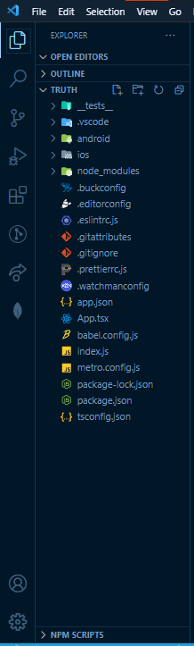

**Cover Image Credits**: Photo by *[Muhammad Rosyid Izzulkhaq](https://unsplash.com/@rsdiz)*

For javascript developers out here, I'm certain we've all heard about the popular kids on the block. I'm talking about React (Web application Development), React Native (Cross platform mobile app development) and Typescript (The gateway to javascript superpowers).

If you haven't heard about Typescript, here's a blog post that serves as an [Introduction to Typescript and its Basic Types](../001-Typescript/intro-to-typescript.md).

For React we can take a look at it in another post. Since our focus is on React Native and Typescript, that is what we will be focusing on this post.

## Introduction
This post will show you how to start up a brand new React Native Typescript project and setup basic navigation routes for easy authentication and authorization.

We will work on a sample app, for now let's call this app: **Truth**

Without much ado, let's get started!!!

## Initialize a new React Native App
1. Move into a folder you want to create your application in. For me, that folder is `projects`.

After moving into your folder, run the command below to create a new react native application with typescript support:
```

react-native init truth --template react-native-template-typescript
```

The command above uses the official `react-native-cli` to create a new application called `truth` and installs a template with typescript support. You must have the react-native-cli package installed globally on your machine for the code above to work.

If you don't want to install the react-native-cli global package you can run the code below to get the same results. Like this:
```
npx react-native init truth --template react-native-template-typescript
```

2. Move into the app project directory.
```
cd truth
```
The code above takes us into the newly created app folder.

3. Open the application in your code editor of choice.

The application folder structure should look like this:



## Finalize configuration
If you look at the project structure image above, you would see that we have a `tsconfig.json` file. This is the file where our typescript configurations live in.

Before we proceed to running our app, we will have to add custom path mappings for our project to make it easier for folder access and navigation.

To do this:
1. Open the `tsconfig.json` file, find the lines of code that look like these that have been commented out:
```
"baseUrl": './',
"paths": {},
```
Uncomment the `baseUrl` line, and replace the `paths` line with the following code:
```
"paths": {
  "*": ["src/*"],
  "tests": ["tests/*"],
  "@components/*": ["src/components/*"],
},
```

What we're doing here is setting the base url path to be the project root folder and adding paths that would automatically resolve to the ones we added in the code above.

The `*` path sets the base path for the `src` folder which we will create later. The `src` folder is where all our code files for the application will live in.

The `tests` path tells typescript to read everything that lives in the `tests` folder. Useful for running tests.

The `@components/*` path is to read everything in the components folder. We will create this folder in the future as well.

2. Add `babel-plugin-module-resolver` to resolve our custom path mappings.

Run the code below inside your application root folder in your terminal
```
npm install -D babel-plugin-module-resolver
```
This should add the `babel-plugin-module-resolver` to your package.json dev dependencies.

3. Locate and update the `babel.config.js` file

Go to your `babel.config.js` file, you'll find a file that looks like this:
```
module.exports = {
  presets: ['module:metro-react-native-babel-preset'],
};
```
Add the code below right after the line with the `presets` configuration:
```
plugins: [
  [
    'module-resolver',
    {
      root: ['./src'],
      extensions: ['.ios.js', '.android.js', '.js', '.ts', '.tsx', '.json'],
      alias: {
        tests: ['./tests/'],
        '@components': './src/components',
      },
    },
  ],
],
```

This configuration makes it possible for babel to resolve the typescript configurations we added earlier.

Now we can proceed to run our application and try it out.

## Running our Application (Android)
To run our newly created application and to see if it works properly, we would need to startup our application.

One way to test this is to use an emulator. In this case, we will be using the Android Emulator available to us from `Android Studio`. Which means we will be running our application on a virtual android device.

### Step 1
Startup your emulator of choice. Make sure you have a virtual device running.

If you're using `Android Studio`, you can check this by typing the following code in your terminal:
```
adb devices
```

This will show you a list of devices available to use to run your app.

### Step 2
Open the `package.json` file in your project root directory and observe the `'scripts'` available.

To start our application, run the code below in your terminal:
```
npm run android
```

This will run the `"android"` command in the `"scripts"` section of your package.json file which will run and install the application on our virtual device.

After the application has finished installing on the virtual device. You should see the demo application open on the virtual device.


## Conclusion

**Voila! 🎉🎉🎉**

You just created and setup a React Native application with Typescript support from scratch.

Next, we will setup Authentication/Authorization routes for our application using React Navigation.

Thank you and see you on the next post.
