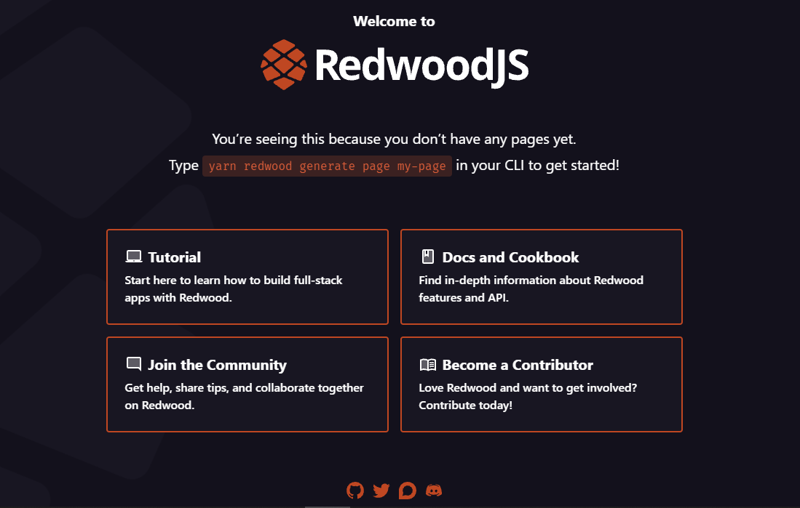

<Header Image Here>

## Quick Summary
RedwoodJS prides itself as the full-stack framework for the Jamstack.

In this tutorial, we are going to learn about RedwoodJS and how to initialize a new RedwoodJS application.

## Goal
At the end of this tutorial you will learn how to bootstrap a RedwoodJS (RwJS) application, understand RwJS project file structure and the RwJS philosophy for full-stack approach to jamstack application development.

## Outline
- [Prequisites](#prerequisites)
- [What is RedwoodJS?](#what-is-redwoodjs)
  - [Understanding what RwJS is and why you should adopt it](#understanding-what-rwjs-is-and-why-you-should-adopt-it)
  - [The features and capabilities of RwJS](#the-features-and-capabilities-of-rwjs)
- [Bootstrapping our RwJS application](#bootstrapping-our-rwjs-application)
  - [Installing RedwoodJS](#installing-redwoodjs)
  - Starting our RwJS application
- [Understanding RwJS File Structure](#understanding-rwjs-file-structure)
  - The Backend Directory
  - The Frontend Directory
- [Conclusion](#conclusion)
  - Summary
  - Resources
  - GitHub Repo

## Prerequisites
To follow this tutorial you should be familiar with the following:
> Yarn Package Manager

> React

> GraphQL

> Prisma - [The GraphQL ORM](https://www.prisma.io/)

> The Jamstack Philosophy - If you have no idea what Jamstack is please read more about it [here](https://www.freecodecamp.org/news/what-is-the-jamstack-and-how-do-i-host-my-website-on-it/).

## What is RedwoodJS?
> According to its [documentation](https://redwoodjs.com/docs/introduction), Redwood is an opinionated, full-stack, serverless web application framework that will allow you to build and deploy JAMstack applications with ease.

### Understanding what RwJS is and why you should adopt it
Redwood is integrated with technologies like React, GraphQL, custom Auth and a couple of other tools out of the box.

Redwood aims to empower you to focus on building what matters without focusing your energy on choosing technologies or tooling that eat up development time.

### The features and capabilities of RwJS
Here are some of the features of Redwood:
- Redwood is open source ❤️
- Standard file structure to support seamless backend and frontend development
- Automatic page-based code-splitting (similar to Gatsby, NextJS)
- GraphQL Api construction without the need for a boilerplate
- Dynamic data-fetching from the Api on the frontend
- Generators for your frontend application (saves a lot of time)
- Easy deployments to [Netlify](https://www.netlify.com/), [Vercel](https://vercel.com/), [Render](https://render.com/) and [Serverless](https://www.serverless.com/) 😍
- Continuous feature upgrades over-time 🔥

For more information on Redwood features please refer to the [documentation](https://redwoodjs.com/docs/introduction).

## Bootstrapping our RwJS application
### Installing RedwoodJS
Redwood uses Yarn to initialize an application and requires the following version of `node` and `yarn` to work properly:

```
node =14.x
yarn >=1.15
```

- Run the command below in your terminal to create a new Redwood app:

```
yarn create redwood-app ./thankful
```
This will start the process of creating a fresh application from scratch and installing `create-redwood-app` package globally on your machine using Yarn. Once the process is completed, you'll find a `thankful` directory which is where all of our application will live moving forward.

- Move into the application directory
```
cd thankful
```
- Start the application in development
```
yarn redwood dev
```
A browser will automatically open up to the url `http://localhost:8910` showing the screen below:



Well done, our application is up and running and ready for development. 🎉

## Understanding RwJS File Structure

## Conclusion