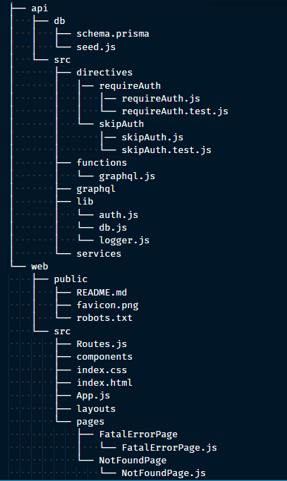

## Quick Summary
RedwoodJS prides itself as the full-stack framework for the Jamstack.

In this tutorial, we are going to learn about RedwoodJS and how to initialize a new RedwoodJS application.

## Goal
At the end of this tutorial you will learn how to bootstrap a RedwoodJS (RwJS) application, understand RwJS project file structure and the RwJS philosophy for full-stack approach to jamstack application development.

## Outline
- [Prequisites](#prerequisites)
- [What is RedwoodJS?](#what-is-redwoodjs)
  - [Understanding what RwJS is and why you should adopt it](#understanding-what-rwjs-is-and-why-you-should-adopt-it)
  - [The features and capabilities of RwJS](#the-features-and-capabilities-of-rwjs)
- [Bootstrapping our RwJS application](#bootstrapping-our-rwjs-application)
  - [Installing RedwoodJS](#installing-redwoodjs)
  - [Starting our RwJS application](#starting-our-rwjs-application)
- [Understanding RwJS File Structure](#understanding-rwjs-file-structure)
- [Conclusion](#conclusion)
  - [Summary](#summary)
  - [Resources](#resources)
  - [GitHub Repo](#github-repo)

## Prerequisites
To follow this tutorial you should be familiar with the following:
> Yarn Package Manager - should be installed on your machine

> React

> GraphQL

> Prisma - [The GraphQL ORM](https://www.prisma.io/)

> The Jamstack Philosophy - If you have no idea what Jamstack is please read more about it [here](https://www.freecodecamp.org/news/what-is-the-jamstack-and-how-do-i-host-my-website-on-it/).

## What is RedwoodJS?
> According to its [documentation](https://redwoodjs.com/docs/introduction), Redwood is an opinionated, full-stack, serverless web application framework that will allow you to build and deploy JAMstack applications with ease.

### Understanding what RwJS is and why you should adopt it
Redwood is integrated with technologies like React, GraphQL, custom Auth and a couple of other tools out of the box.

Redwood aims to empower you to focus on building what matters without focusing your energy on choosing technologies or tooling that eat up development time.

### The features and capabilities of RwJS
Here are some of the features of Redwood:
- Redwood is open source ❤️
- Standard file structure to support seamless backend and frontend development
- Automatic page-based code-splitting (similar to Gatsby, NextJS)
- GraphQL Api construction without the need for a boilerplate
- Dynamic data-fetching from the Api on the frontend
- Generators for your frontend application (saves a lot of time)
- Easy deployments to [Netlify](https://www.netlify.com/), [Vercel](https://vercel.com/), [Render](https://render.com/) and [Serverless](https://www.serverless.com/) 😍
- Continuous feature upgrades over-time 🔥

For more information on Redwood features please refer to the [documentation](https://redwoodjs.com/docs/introduction).

## Bootstrapping our RwJS application
### Installing RedwoodJS
Redwood uses Yarn to initialize an application and requires the following version of `node` and `yarn` to work properly:

```
node =14.x
yarn >=1.15
```

- Run the command below in your terminal to create a new Redwood app:

```
yarn create redwood-app ./thankful
```
This will start the process of creating a fresh application from scratch and installing `create-redwood-app` package globally on your machine using Yarn. Once the process is completed, you'll find a `thankful` directory which is where all of our application will live moving forward.

### Starting our RwJS application
- Move into the application directory
```
cd thankful
```
- Start the application in development
```
yarn redwood dev
```
A browser window will automatically open up to the url `http://localhost:8910` showing the screen below:


Well done, our application is up and running and ready for development. 🎉

## Understanding RwJS File Structure
Let's take a look at the file structure of our app. We will ignore the configuration files for now and focus on the core app directories `api` and `web`.

In Yarn, these are called `workspaces` but Redwood calls them `sides`. When installing packages moving forward we will make use of these.

We will learn how to work with these soon.



The `api` directory contains all files and logic for our server, database configurations, business logic, graphql setup and serverless functions. In summary, this is our backend server directory.

The `web` directory is where the code for our frontend app lives. Redwood by default configures our routes, layouts and pages for our application.

## Conclusion
### Summary
In this tutorial we have learnt what RedwoodJs is, the problem Redwood aims to solve, how to start a Redwood project from scratch and how to understand the file structure of a Redwood project.

I will suggest you go ahead and create a repository on GitHub and push your application to it, as we will want to keep track of our progress moving forward. If you aren't familiar with how to do this, you can find more information in the [Resources](#resources) section.

### Resources
- [Yarn Package Manager](https://yarnpkg.com/)
- [ReactJS](https://reactjs.org/)
- [GraphQL](https://graphql.org/)
- [JAMstack](https://jamstack.org/)
- [Redwood Official Website](https://redwoodjs.com/)
- [Redwood Documentation](https://redwoodjs.com/docs/introduction)
- [How to Push an Existing Project to GitHub](https://www.digitalocean.com/community/tutorials/how-to-push-an-existing-project-to-github)

### GitHub Repo
[Thankful App](https://github.com/evansibok/thankful)

Next, we will learn [How to Add a Postgres Database and Generate Models in a Redwood App](../004-How%20to%20Add%20a%20Postgres%20Database%20and%20Generate%20Models%20in%20a%20Redwood%20App/how-to-add-a-postgres-database-and-generate-models-in-a-redwood-app.md)
