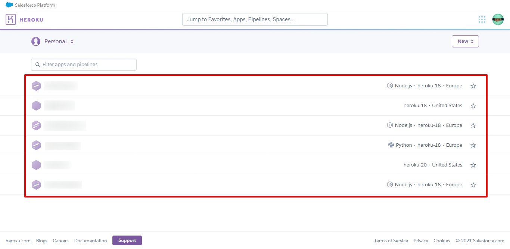
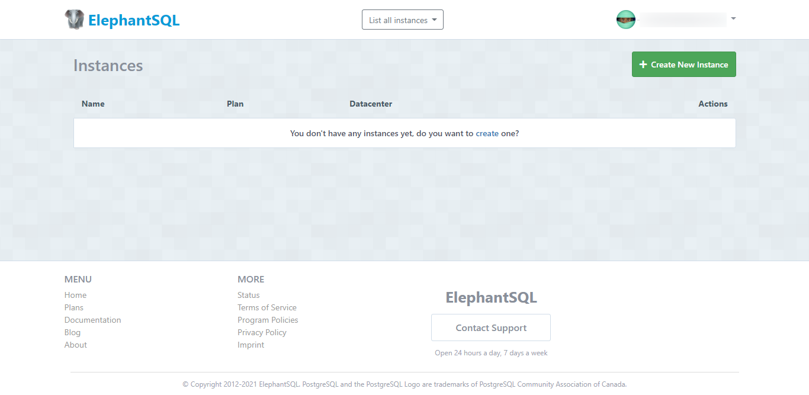
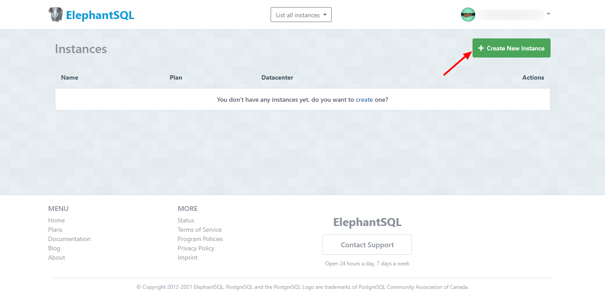
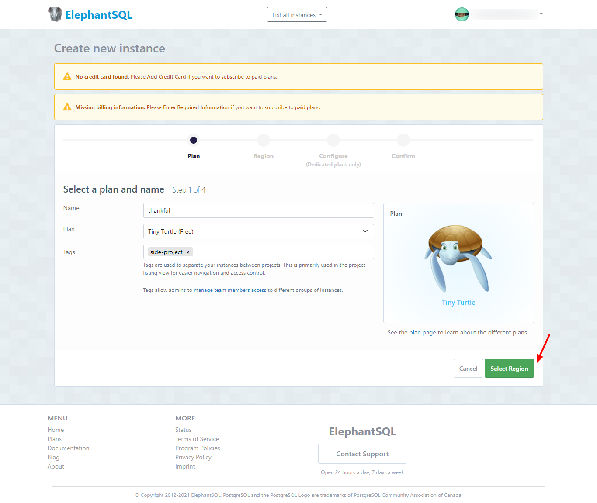
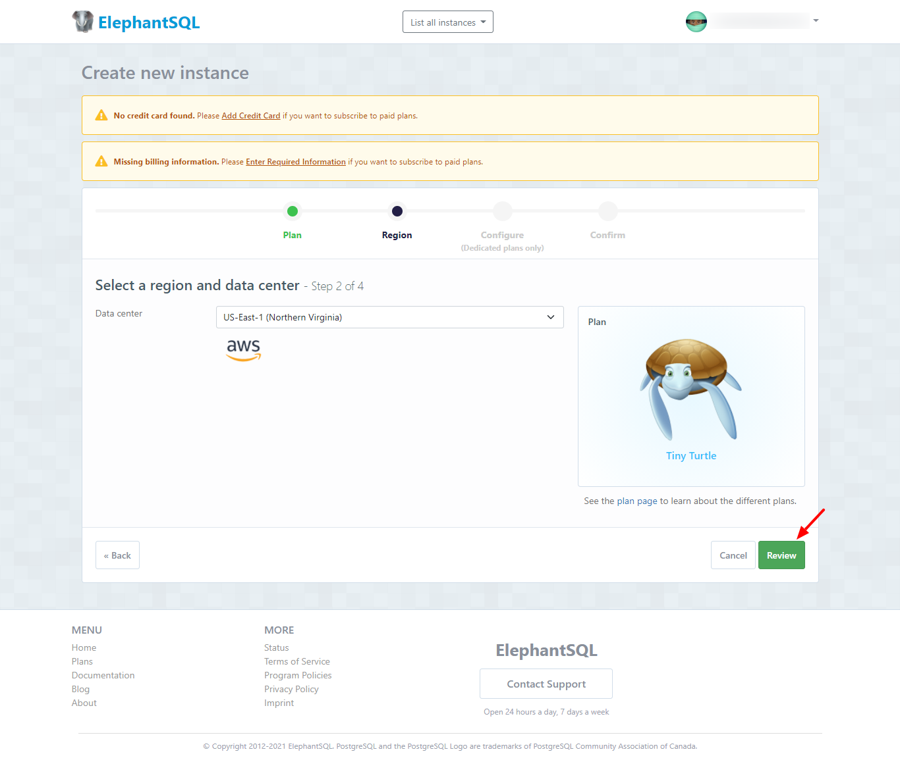
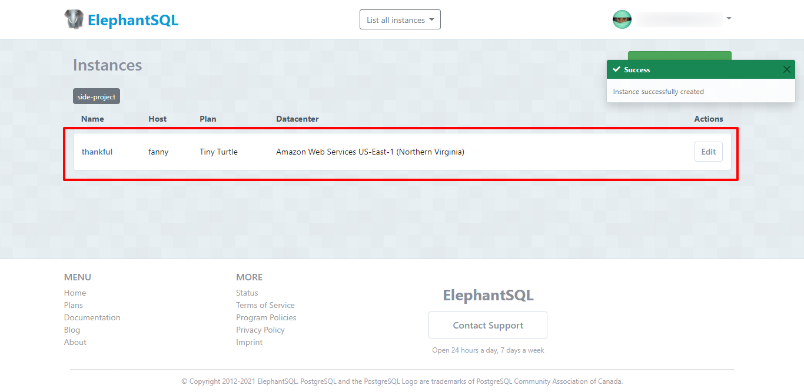
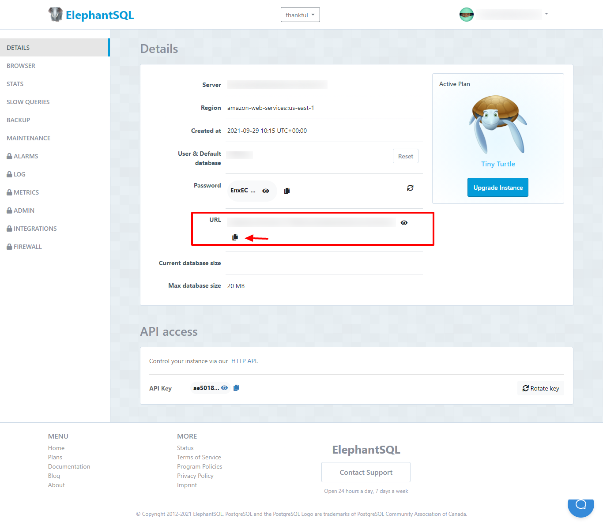
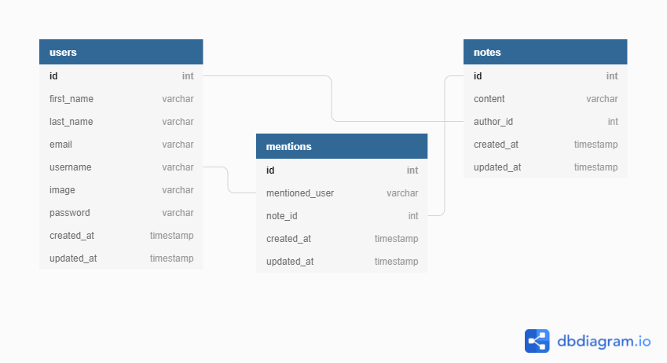
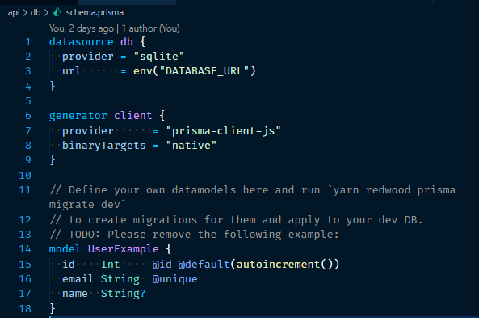
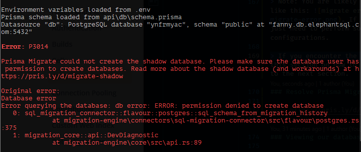

## Quick Summary

In our **[previous post](../003-Bootstrapping%20a%20RedwoodJS%20Application/bootstrapping-a-redwoodjs-application.md)**, we learnt how to bootstrap a redwood app from scratch, continuing from there, in this tutorial we are going to learn how to add a Postgres database using Heroku and Generate models for our journaling application using Prisma and Redwood generators.

## Goal

At the end of this tutorial, you will learn how to provision a Heroku Postgres Database, connect the database to our Redwood app, generate GraphQL schemas and the logic needed to perform CRUD operations for all our models.

## Outline

- [Prequisites](#prerequisites)
- [Creating our Postgres Database on Heroku](#creating-out-postgres-database-on-heroku)
  - [Creating a NodeJS app on Heroku](#creating-a-nodejs-app-on-heroku)
  - [Add a Postgres Database to our Heroku App](#adding-a-postgres-database-to-our-heroku-app)
- [Adding Postgres Database to our Redwood App](#adding-postgres-database-to-our-redwood-app)
  - [Getting our DATABASE URL from our Heroku App](#getting-our-database-url-from-our-heroku-app)
  - [Adding our DATABASE URL to environment variable in our Redwood App](#adding-our-database-url-to-environment-variable-in-our-redwood-app)


<!-- - [Creating our Postgres Database on ElephantSQL](#creating-our-postgres-database-on-elephantsql)
- [Adding our DATABASE URL to environment variable in our Redwood App](#adding-our-database-url-to-environment-variable-in-our-redwood-app) -->
- [Generating GraphQL Schemas](#generating-graphql-schemas)
  - [Replacing Redwood default DB engine with postgres](#replacing-redwood-default-db-engine-with-postgres)
  - [Adding User, Mention and Note models](#adding-user-mention-and-note-models)
  - [Generating Database Migrations and Models for our Redwood App](#generating-database-migrations-and-models-for-our-redwood-app)
- [Viewing our database in Heroku Dashboard](#viewing-our-database-in-heroku-dashboard)
- [Conclusion](#conclusion)
  - [Summary](#summary)
  - [Resources](#resources)
  - [GitHub Repo](#github-repo)

## Prerequisites

This tutorial assumes that you have a basic understanding of [Prisma ORM](https://www.prisma.io/).
## Creating our Postgres Database on ElephantSQL
Heroku is a Platform-as-a-service tool for building and managing your application infrastructure in the cloud. You can host your apps on Heroku and get a live url to access them.

Heroku also has other tools like `Heroku Postgres` which is a cloud-managed postgres database service. This is where we'll create our database for this app.

If you don't already have an account on Heroku, head on to [Heroku Website](https://www.heroku.com/) and create one. Then log in to your account and you'll be taken to your dashboard, which looks something like this:



<!-- ElephantSQL is a PostgreSQL-as-a-service platform. You can set up a cloud postgres database in about 3 minutes. It's pretty straight forward.

Head over to [ElephantSQL Website](https://www.elephantsql.com/) to create an account and login to start creating our database.

Once logged in, your dashboard should look something like this:



Follow the steps below to create a Postgres Database.

- Click on the **`Create New Instance`** button
  

- Enter a name for your database and click the **`Select Region`** button
  

- Select your region (I typically leave it at the default AWS selection) and click the **`Review`** button
  

- Review your selection to ensure you have the right configuration, then click the **`Create Instance`** button to continue
  

- Your database will be created and you'll be redirected back to your dashboard 🎉
  

- To get our DATABASE URL, click on the database name in the dashboard and you'll be taken to the database console. _Notice the URL shown in our console as we'll copy and paste it in our Redwood app in the next step._
   -->

<!-- ### Creating a nodeJS app on Heroku -->
<!-- ### Adding a Postgres Database to our Heroku App -->

<!-- ## Adding Postgres Database to our Redwood App -->
<!-- ### Getting our DATABASE URL from our Heroku App -->

## Adding our DATABASE URL to environment variable in our Redwood App

In the root of our `thankful` project, you'll find a `.env` file. Copy the `URL` From our database console in `ElephantSQL` and paste it as the value for the `DATABASE_URL` key inside our `.env` file.

## Generating GraphQL Schemas

Now, we are going to create and generate our database tables which we will persist to the postgres database we just created.

Personally, before I start writing my database tables, I use a tool called [DB Diagram](https://dbdiagram.io/) to design and understand my database relationships visually.

As we are building a journaling application, we reckon we will need the following features:

- user account creation
- notes creation where users can be mentioned inside of notes, plus the ability to update, query and delete notes.

So with this in mind, we came up with the following database model using db diagram:


A straight forward explanation for the above model goes like this:

- users table (user creates account)
- notes table (user creates a note and becomes the author of that note)
- mentions table (user can mention another user when creating a note)

Since a user can be mentioned in multiple notes by different authors, and we can have multiple mentioned users in a single note, then it makes sense to have a mentions table to connect mentioned users to the notes they are mentioned in.

For more on table relationships, refer to the resources section in this post.

### Replacing Redwood default DB engine with postgres

To locate our schema file, from inside the `api` directory in our root project, open up the `db` directory and you'll find a `schema.prisma` file. The contents of our default `schema.prisma` file looks like this:


- Change the `datasource db provider` from `sqlite` to `postgresql`

If you look closely, you'll see the `datasource db url` already reads the database url from our environment file with the key `DATABASE_URL`. Since we already updated this to our `ElephantSQL` URL, we are good to go.

### Adding User, Mention and Note models

In our `schema.prisma` file above we have a default `UserExample` model, replace the default model code in our file with the code below:

```
// api/db/schema.prisma

model User {
  id        Int       @id @default(autoincrement())
  firstName String
  lastName  String
  email     String    @unique
  username  String    @unique
  image     String
  password  String
  createdAt DateTime  @default(now())
  updatedAt DateTime  @updatedAt
  notes     Note[]
  mentions  Mention[]

  @@map("users")
}

model Note {
  id        Int       @id @default(autoincrement())
  content   String
  author    User      @relation(fields: [authorId], references: [id])
  authorId  Int
  mentions  Mention[]
  createdAt DateTime  @default(now())
  updatedAt DateTime  @updatedAt

  @@unique([authorId])
  @@map("notes")
}

model Mention {
  id                Int      @id @default(autoincrement())
  mentionedUser     User     @relation(fields: [mentionedUsername], references: [username])
  mentionedUsername String
  note              Note     @relation(fields: [noteId], references: [id])
  noteId            Int
  createdAt         DateTime @default(now())

  @@unique([mentionedUsername, noteId])
  @@map("mentions")
}
```

The code above creates User, Note and Mention models for our db schema. To understand how we created the schema above please refer to the [Prisma Schema Docs](https://www.prisma.io/docs/concepts/components/prisma-schema).

### Generating Database Migrations and Models for our Redwood App
Now we have to migrate our database models so it can be in sync with Prisma and write to our database in `ElephantSQL`.

Run the command below to migrate our database:
```
yarn redwood prisma migrate dev
```

> Note: You are likely to run into an error like this: 
If you do, do not fret. We just need to perform some minor configurations.

> If you encounter the error above, refer to the section directly below on how to fix it, otherwise continue to the next section.
### Resolve Prisma Migration Error
In Prisma, when we run development-focused commands like `prisma migrate dev`, Prisma uses a second temporary database called `shadow database` to monitor and detect problems.

> The shadow database is not required when running production commands like `prisma migrate deploy`.

Another caveat is that since we are using a cloud database like `ElephantSQL` we will have to create this `shadow database` manually. What better way to do that than to use `ElephantSQL` like we did when we created our main database.

> Please run through the database creation steps we used earlier to create a second database on `ElephantSQL` and get the URL for this database ready for use.

Once you have successfully created the shadow database, follow the steps below:

- Add this line `shadowDatabaseUrl = env("SHADOW_DATABASE_URL")` inside your `schema.prisma` file
- Go to your `.env` file and add the variable `SHADOW_DATABASE_URL` to it
- Copy the URL of your shadow database from your ElephantSQL Console and paste it as the value of the `SHADOW_DATABASE_URL` variable


<!-- https://pris.ly/d/migrate-shadow -->

### Viewing our database in Heroku Dashboard

## Conclusion

### Summary

### Resources

- [SQL Table Relationships Explained](https://code.tutsplus.com/articles/sql-for-beginners-part-3-database-relationships--net-8561)

### GitHub Repo

[Thankful App](https://github.com/evansibok/thankful)

Next, we will learn [What is the next topic?](#)
