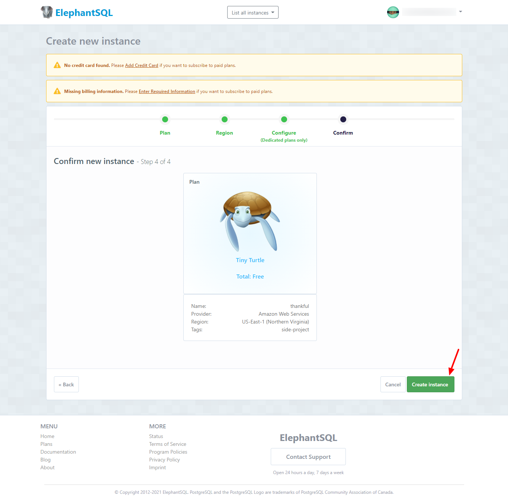

## Quick Summary

In our __[previous post](../003-Bootstrapping%20a%20RedwoodJS%20Application/bootstrapping-a-redwoodjs-application.md)__, we learnt how to bootstrap a redwood app from scratch, continuing from there, in this tutorial we are going to learn how to add a Postgres database using Heroku and Generate models for our journaling application using Prisma and Redwood generators.

## Goal

At the end of this tutorial, you will learn how to provision a Heroku Postgres Database, connect the database to our Redwood app, generate GraphQL schemas and the logic needed to perform CRUD operations for all our models.

## Outline
- [Prequisites](#prerequisites)
- [Creating our Postgres Database on ElephantSQL](#creating-our-postgres-database-on-elephantsql)
  <!-- - [Creating a nodeJS app on Heroku](#creating-a-nodejs-app-on-heroku) -->
  - [Adding a Postgres Heroku Database to our Heroku App](#adding-a-postgres-heroku-database-to-our-heroku-app)
- [Adding Postgres Database to our Redwood App](#adding-postgres-database-to-our-redwood-app)
  - [Getting our DATABASE URL from our Heroku App](#getting-our-database-url-from-our-heroku-app)
  - [Adding our DATABASE URL to our environment variable file in Redwood](#adding-our-database-url-to-our-environment-variable-file-in-redwood)
- [Generating GraphQL Schemas](#generating-graphql-schemas)
  - [Replacing Redwood default DB engine with postgres](#replacing-redwood-default-db-engine-with-postgres)
  - [Adding User, Mention and Note models](#adding-user-mention-and-note-models)
  - [Generating Database Migrations and Models for our Redwood App](#generating-database-migrations-and-models-for-our-redwood-app)
- [Viewing our database in Heroku Dashboard](#viewing-our-database-in-heroku-dashboard)
  - 
- [Conclusion](#conclusion)
  - [Summary](#summary)
  - [Resources](#resources)
  - [GitHub Repo](#github-repo)

## Prerequisites
This tutorial assumes that you have a basic understanding of [Prisma ORM](https://www.prisma.io/), every other thing will be taught.

## Creating our Postgres Database on ElephantSQL
<!-- Heroku is a Platform-as-a-service tool for building and managing your application infrastructure in the cloud. You can host your apps on Heroku and get a live url to access them.

Heroku also has other tools like `Heroku Postgres` which is a cloud-managed postgres database service. This is where we'll create our database for this app.

If you don't already have an account on Heroku, head on to [Heroku Website](https://www.heroku.com/) and create one. Then log in to your account and you'll be taken to your dashboard, which looks something like this:

 -->

ElephantSQL is a PostgreSQL-as-a-service platform. You can set up a cloud postgres database in about 3 minutes. It's pretty straight forward.

Head over to [ElephantSQL Website](https://www.elephantsql.com/) to create an account and login to start creating our database.

Once logged in, your dashboard should look something like this:

Follow the steps below to create a Postgres Database.

- Click on the __`Create New Instance`__ button

- Enter a name for your database and click the __`Select Region`__ button

- Select your region (I typically leave it at the default AWS selection) and click the __`Review`__ button

- Review your selection to ensure you have the right configuration, then click the __`Create Instance`__ button to continue

- Your database will be created and you'll be redirected back to your dashboard 🎉

- To get our DATABASE URL, click on the database name in the dashboard and you'll be taken to the database console. _Notice the URL shown in our console as we'll copy and paste it in our Redwood app in the next step._

<!-- ### Creating a nodeJS app on Heroku -->
<!-- ### Adding a Postgres Database to our Heroku App -->

## Adding Postgres Database to our Redwood App
<!-- ### Getting our DATABASE URL from our Heroku App -->
### Adding our DATABASE URL to our environment variable file in Redwood

## Generating GraphQL Schemas
### Replacing Redwood default DB engine with postgres
### Adding User, Mention and Note models
### Generating Database Migrations and Models for our Redwood App

## Viewing our database in Heroku Dashboard
## Conclusion

### Summary
### Resources
### GitHub Repo
[Thankful App](https://github.com/evansibok/thankful)

Next, we will learn [What is the next topic?](#)
